# Monome Arc Clone

An open source, protocol-compatible clone of the monome arc.

## Before you start

Please note: if you encounter a problem, please **do not post on the
monome forums**! Tehn will surely help you, but I don’t want my clone
to cause them trouble and work. I’m very happy that they make their
protocols open and I would like them to continue to do so in the spirit
of openness.

For assistance, please write an email to my address instead:
<mail@johannesneumann.net> I will try to help you out.

## Required tools

During assembly and setup you will need the following tools

-   AVR ISP programming device (supported by avrdude). I recommend
    [USBasp](http://www.fischl.de/usbasp/) or any of its clones.
    Alternatively you can also use STK500v2 clones or any other
    programmer that supports the ISP protocol. You get something like
    this on ebay for under 20€.
-   Soldering iron, decent(!) flux, tweezers, solder wick
-   a computer capable of flashing AVRs and FTDI EEPROMs
-   a multimeter

## Software installation

Before you start, please install all the software that’s needed to run monome devices. Please look at the instructions provided by [http://monome.org](http://monome.org/). Even though you might not have a functioning monome at this point, we will need the drivers during the setup process.

Install the drivers for your AVR ISP programmer, if you haven’t already.

### Windows

Install *WINAVR* from [this link](http://www.webring.org/l/rd?ring=avr;id=59;url=http://winavr.sourceforge.net/). This will install a AVR compiler and (more important) a tool called *avrdude* to upload the software to the ATMega88p microprocessor used in the device.

Install *AVR-Burn-O-Mat* from [this link](http://avr8-burn-o-mat.aaabbb.de/). This little tool will make it easier to upload the software to the chip as it provides a nice graphical user interface to *avrdude* installed with WINAVR.

Now we need to edit some files. Unfortunately as I am writing this (05.11.2014) it seems that some versions of *avrdude* and *AVR-Burn-O-Mat* don’t know the ATMega88p processor yet. So we teach them that it exists.

First, go to C:\\WINAVR\...\....\\bin\\avrdude.conf and open it with a text editor (I recommend geany).

Search for "ATMega88p". If it takes you to something like this:

```
#------------------------------------------------------------

# Atmega88p

#------------------------------------------------------------
```

…then you don’t have to edit anything and the file is fine. Simply go to the next step.

If nothing is found, search for this part:

```
#------------------------------------------------------------

# ATmega88

#------------------------------------------------------------
```

This is the header for the (almost) equal ATMega88. We simply copy the whole passage below this line (down to the next similar looking header) and change a few things. The whole passage you have to copy is roughly 200 lines long.

Duplicate the whole passage and change the lines highlighted with yellow:

```
#------------------------------------------------------------

# ATmega88p

#------------------------------------------------------------

part

id = "m88p";

desc = "ATMEGA88P";

has_debugwire = yes;

flash_instr = 0xB6, 0x01, 0x11;

eeprom_instr = 0xBD, 0xF2, 0xBD, 0xE1, 0xBB, 0xCF, 0xB4, 0x00,

0xBE, 0x01, 0xB6, 0x01, 0xBC, 0x00, 0xBB, 0xBF,

0x99, 0xF9, 0xBB, 0xAF;

stk500_devcode = 0x73;

# avr910_devcode = 0x;

signature = 0x1e 0x93 0x0f;

pagel = 0xd7;

bs2 = 0xc2;

...

... more stuff follows here ...

...
```

Now avrdude knows the microprocessor.

Now we have to teach *AVR-Burn-O-Mat* as well. Go to the installation directory (mine is: `D:\Program Files (x86)\AVR Burn-O-Mat)` and open the file `AVR8_Burn_O_Mat_Config.xml`. With a text editor (e.g. geany).

Again, search for "Atmega88p". If nothing is found, search for "Atmega88". It should take you to this line:

```<AVR name="m88" caption="ATmega88">

<Fuse name="UNUSED_E7" bit="7" ...

...

...
```

Now open *AVR-Burn-O-Mat* and go to the settings page. Check if the directories are correct and enter the connection settings for your programmer.

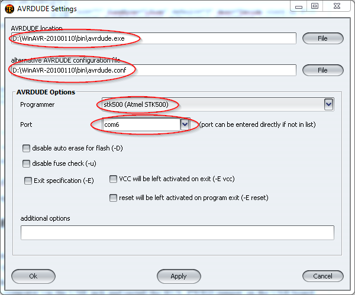

I’m using an STK500V2 clone here, but if you click the dropdown menu, it will give you other options, such as USBasp. For most USB programmers, the Port must be set to "usb" or (if they are based on a serial COM interface) the respective COM port. You can open the device manager and plug in your programmer, then it should display the COM port in brackets behind the device name.

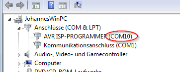

Install FT-Prog from [this website](http://www.ftdichip.com/Support/Utilities.htm). We will need it to configure the FTDI USB chip on the board.

### Linux

On Linux, install avrdude using your system’s package manager.

Compile libftdi with the confuse library already present, and make sure you can run the ftdi_eeprom command it comes with. This is currently untested on linux, please refer to [this guide](https://waterpigs.co.uk/articles/ftdi-configure-mac-linux/) for pointers on how to do it.

### Mac OS X

Install avrdude, and avr-gcc if you want to compile your own hex files. You can do this either manually, or via [CrossPack](https://obdev.at/products/crosspack/download.html).

In order to be able to flash the FTDI chip’s EEPROM, you’ll need to install libftdi with the confuse library already installed. This is possible either manually, or using homebrew with a change to the libftdi formula detailed [here](https://waterpigs.co.uk/articles/ftdi-configure-mac-linux/).

Some old versions of CrossPack will be missing the avrdude reference files for the ATMega88p. You can test this by running `avrdude -c stk500v2 -p m88p`. If you get `avrdude: AVR Part "88p" not found.` then follow the instructions in the Windows section above, duplicating the ATMega88 definition for the 88p. Look for an avrdude.conf file to make these changes in, e.g. `/usr/local/CrossPack-AVR-20100115/etc/avrdude.conf`


## USB Board Assembly

I won’t give step-by-step instructions for soldering. If you are not familiar with soldering and electronics in general, please do an easier project first. It can become very frustrating otherwise.

Once you’re done assembling the USB board, go to the device manager (Windows) or USB Prober (Mac OS). Connect the USB board to your computer via the USB jack and install the BUS\_PWRD jumper on the USB board. You should see the device manager refresh and a new COM port device will appear.

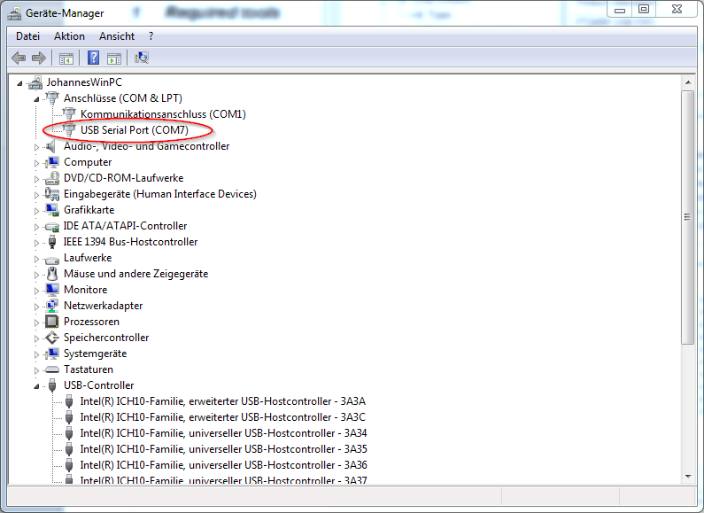

If it does not appear, please disconnect it immediately and check your soldering!

Now we have to check the voltage of the on-board regulator. Connect a multimeter to the pins highlighted in the following picture:

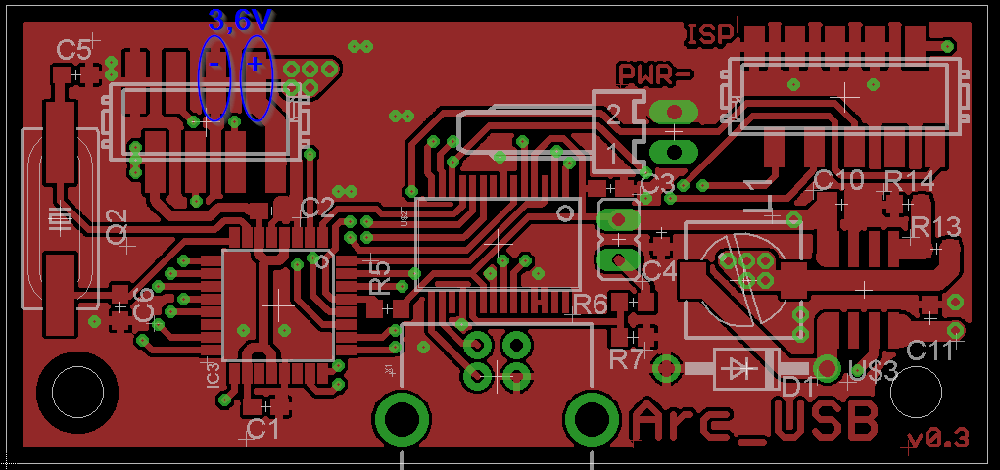

Your meter should read 3,6V (or thereabouts). Fine, it looks like everything is okay.

Lets go on and flash the firmware to the chip. Connect your programmer to the 10-pin connector on the USB board. This connector is not the one commonly used for AVR devices, but it uses the same pinout and attaches to the same type of cables. You can simply use your programmers 10-pin cable and crimp micromatch connector to it. This should now be plugged into the USB board. Check the orientation. A good help can be the four ground-pins, which are connected to each other. On both the USB board and the programmer. Pin 1 of the cable is on the opposite side. In the image above, it is the pin on the bottom right of the connector, next to the "R14" label.

Also be sure, that the USB board is plugged into your computer as well and the BUS\_PWRD jumper is installed, so the processor receives power.

### Windows (AVR-Burn-O-Mat + FT_PROG)

Open *AVR-Burn-O-Mat *and connect your programmer to your PC.

First, we need to change the fuse-bits in the processor, to use the external 20MHz crystal as a clock source. Select Atmega88p from the "AVR type" menu. Then click on "Fuses"

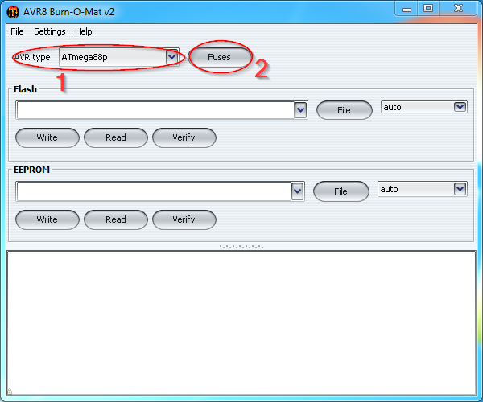

In the new window, click "read fuses".

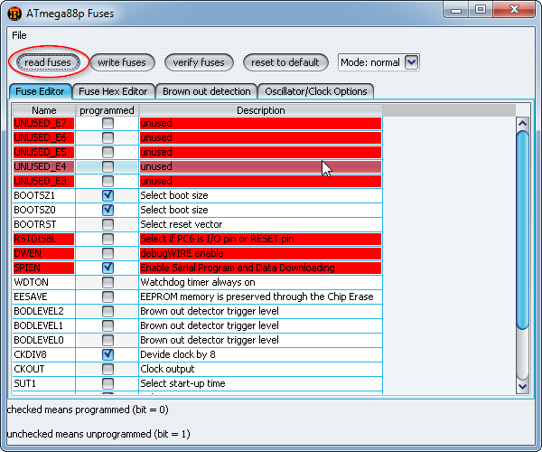

You should see some commands run in the bottom of the main window and eventually a message will pop up, saying: "fuses successfully read". If not: Check the commands in the main window. They can give you a hint to where the problem is. Usually the programmer settings are wrong (wrong COM port\...) or the USB board is not connected properly. Some programmers offer a "low speed" programming mode, this should be used, as the processor is currently still running at its internal low clock speed.

If verything is fine, we can edit the fuse-bits to use the external crystal. Click on the "Oscillator/Clock Options" tab, then un-tick "divide system clock by 8" and select the "Full swing crystal oscillator" tab.

Double check everything! You might screw your chip up! Never attempt to write the fuses, if you were not able to correctly read them before. You might end up with a chip that has its programming interface disabled and can’t be rescued even with professional equipment.

Okay, once you are sure, everything is correct and matches the image below, you can click "write fuses" and again, some commands should run in the main window and a message should say: "Fuses successfully written". Then click "read fuses" again. If they can be read successfully, you have done everything right.

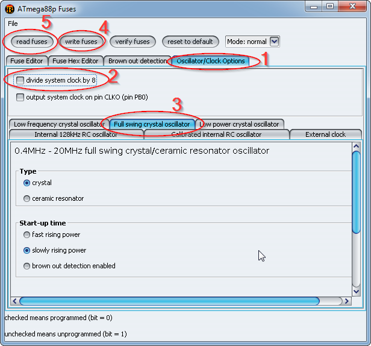

Now we can flash the firmware. Close the fuses window and select the firmware file in the main window. I recommend to use the pre-compiled one in the repository. I want to build an arc 4 here, so I chose the matching firmware. Be sure to use the right file. Using another file will probably make the processor "think" its connected to some hardware which is not there. This can create short circuits and might destroy the chip. So please double check here!

Click "write" and the commands in the bottom of the window should start executing again. Eventually it will say "Flash sucessfully written."

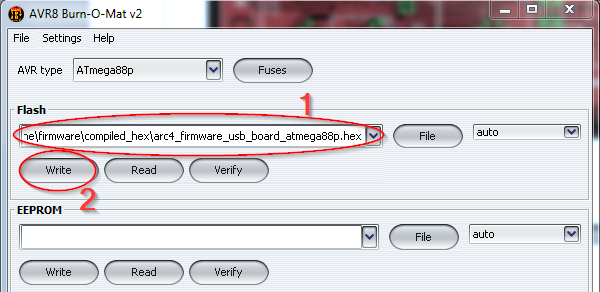

Nice! Now you can unplug the programmer.

Now we have to configure the USB-chip on the board to be recognized by serialosc so you can use your clone just like a real monome arc.

Start FT\_PROG and connect the USB board to your computer via its USB connector. In the FT\_PROG window, click the search icon until it displays your device.

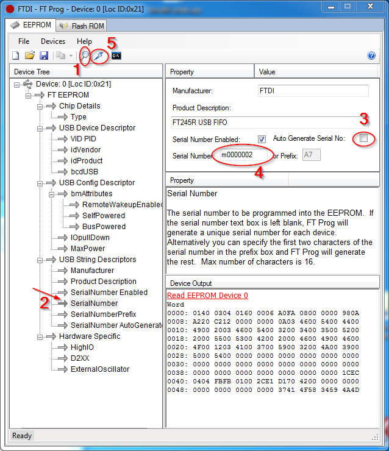

Eventually after a few retries you get this. Go to the "SerialNumber" tab and untick "Auto Generate Serial No:". Now you can edit the "serial number" field. Enter a serial number like in the image above. It should start with an "m" and the numbers after that are irrelevant, but I found that they should be 7 digits long. They represent the "unique number" of your device. If you have other monomes, be sure that you use a different serial number that the one of your other devices. Also change the manufacturer to "monome", this is important for compatibility with monome eurorack modules and the Aleph. Once you’re done, click the flash symbol and program the new settings to the chip.

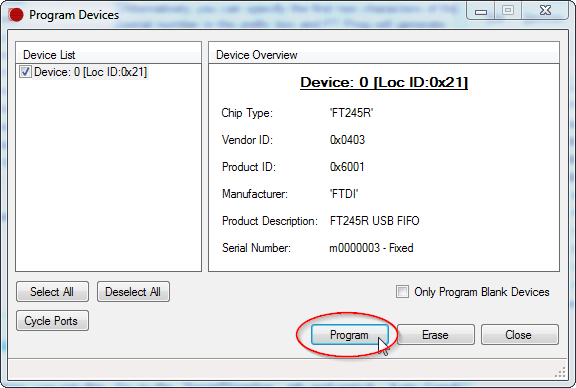

### Linux/Mac OS (avrdude + libftdi ftdi_eeprom)

Connect your AVR programmer to your computer, and the USB board to the programmer. In each of the following commands, replace `YOUR_PROGRAMMER_ID` with the relevant ID (e.g. stk500v2) and `YOUR_PROGRAMMER_PORT` with the relevant port (e.g. `/dev/cu.usbmodem00177932`.

First, set the fuses, based on [this fuse calculation](http://eleccelerator.com/fusecalc/fusecalc.php?chip=atmega88p&LOW=D6&HIGH=DF&EXTENDED=F9&LOCKBIT=FF):

`avrdude -V -p m88p -c YOUR_PROGRAMMER_ID -P YOUR_PROGRAMMER_PORT -B 10 -e -u -U lfuse:w:0xD6:m -U hfuse:w:0xDF:m -U efuse:w:0xF9:m -U lock:w:0xFF:m`

Then, flash the USB board firmware. Swap `arc4_` for `arc2_` in the unlikely event you’re building a two-ring arc):

`avrdude -V -p m88p -c YOUR_PROGRAMMER_ID -P YOUR_PROGRAMMER_PORT -B 2 -U flash:w:./firmware/compiled_hex/arc4_firmware_usb_board_atmega88p.hex:i -U lock:w:0xFF:m`

To flash the FTDI EEPROM, edit `firmware/monome-arc-clone-ftdi-eeprom.conf` to have your desired serial number (which must be m followed by seven digits), then run the following command with your FTDI driver disabled:

`ftdi_eeprom --flash-eeprom firmware/monome-arc-clone-ftdi-eeprom.conf`

Don’t forget to re-enable your FTDI driver afterwards! Refer to this [libftdi guide](https://waterpigs.co.uk/articles/ftdi-configure-mac-linux/) for more information.

### Testing

Now you can open a monome app with your USB board connected, and you should see your clone appear in the device list. If it does not appear, check your serialosc settings.

## Pot board and ring board assembly

Assemble the ring boards and the pot boards. Start with one pair of them to find errors early.

At full brightness, each LED is supplied with a 3.3V square wave with 25% duty cycle, current limited to around 2.6mA (with a 9.1kohm current set resistor). Not all LEDs perform well at such low currents. Testing found the IN-S63AT5UW to be an excellent trade-off between price and performance. Prices in the comparison are from late 2018.

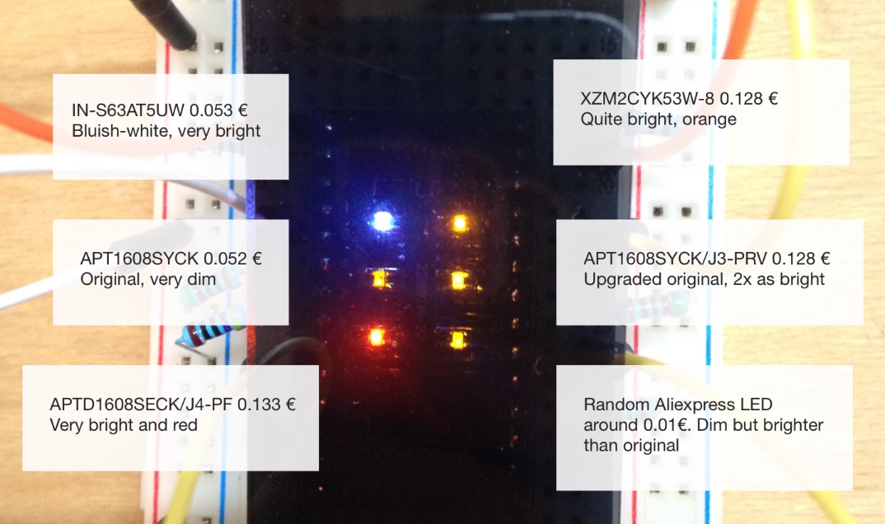

When soldering the surface mounted headers which connect each ring board to the encoder board, solder only one connector first, insert the other connector onto that, then temporarily screw the boards together and make a couple of solder joints to fix the other connector in exactly the right mating position. If soldered without checking the location, you risk the boards being misaligned.

Use the 8pin micromatch connectors and ribbon cables to connect the pot board to the USB board via their micromatch connectors (Not the one marked with ISP, the smaller one.) Connect the USB board to your computer and check the BUS\_PWRD jumper. The USB board should now receive power, and supply the pot board via the ribbon cable that connects the two.

Attach your AVR programmer to the board, then set the fuses and flash the firmware as with the USB Board, but using `firmware_pot_board_atmega88p.hex` rather than the USB board hex file.

Once the pot boards processor is programmed with the right fuses and firmware, you should disconnect the usb cable and set the address selection switch to off/off. This equals to address 0, which is used for the first LED ring in the monome arc clone.

Now attach the led ring.

Connect the USB board to the computer again and the led ring should light up for a short time (part of the startup animation). Open the [monome arc test app](http://docs.monome.org/lib/exe/fetch.php?media=app:monome_test_110.zip) and check everything.

Then assemble the other boards and connect them to the ribbon cable. Flash them the same way and check them with the test app. Be sure to use the right addresses:

```
  ------------- ---------- ----------
  Ring number   Switch 2   Switch 1
  0             Off        Off
  1             Off        On
  2             On         Off
  3             On         On
  ------------- ---------- ----------
```

Double check that all the boards function correctly before final assembly. Make sure that all LEDs light, that the encoders send turn and button press messages, and that the boards are in the right order.

## Physical Case Construction and Assembly

Assuming you’re working with a milled panel based on `case/Alu Faceplate.pdf` and laser cut acrylic parts based on the Glas-Ring and Light_Shaper drawings, assembly is quite straightforward. The fit of the laser cut parts is tight, and often the outer diameter is slightly larger on one edge than the other, so look carefully at the edge angles of both parts and experiment with their orientation to find the best results. You can see the angles here:

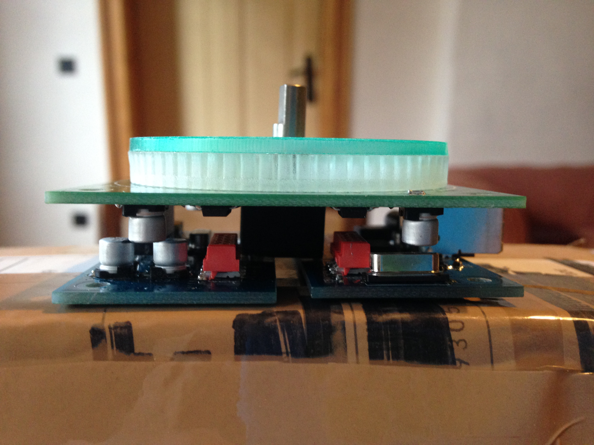

Depending on the quality of your laser cutter, you may have to manually remove some leftover parts from the light shaper with a small sharp knife.

For a more diffused LED appearance, either cut the rings from frosted acyrlic, lightly sand the underside of the rings with 400 grit sandpaper, or perhaps put a ring of very thin paper between the ring and light shaper.

The blind threaded holes in the top panel are not deep enough for normal male-female M3 hex spacers, so insert 12mm setscrews (preferably fastened with thread lock e.g. loctite) and then screw 4mm female-female hex spacers over them before attaching the ring board.

The simplest case solution is to cut a 4mm acrylic backplate from `case/Acrylic Glass Back Panel 266 x 74.svg`, then assemble the boards and plates as shown (note that the given acrylic back plate has one set of mounting holes in a different location to shown here. Either cut the backplate with holes in the outside corners, or alter the assembly to suit):

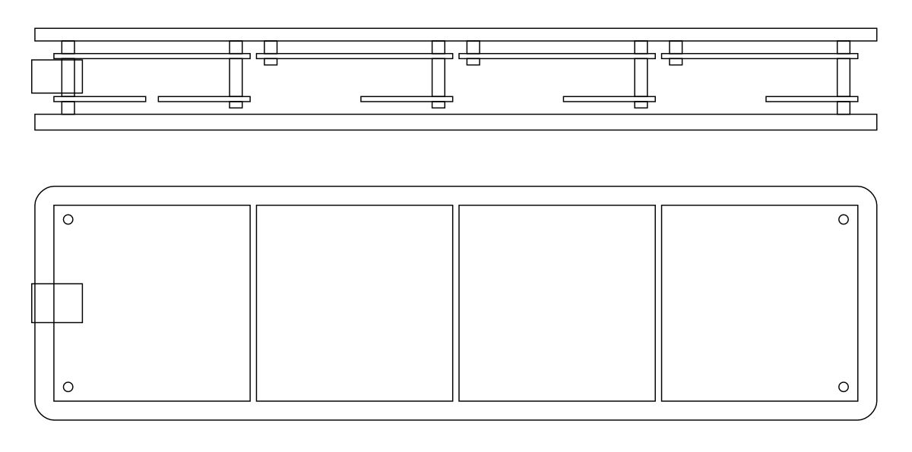

You’ll need the following hardware:

* 16 x 12mm M3 Set Screw
* 16 x 4mm M3 FF hex spacer
* 10 x 12mm M3 FF hex spacer
* 4 x 4mm M3 MF hex spacer
* 6 x M3 Nut
* 6 x 6mm M3 Screw
* 4 x 8mm M3 Screw

If you want to build a more comprehensive case, refer to the layout in `case/Monome Arc Clone Walnut Case.ezdraw` and `case/Monome Arc Clone Walnut Case Plans 500 x 360.svg` for dimensions to design a case around. Make sure the bounding box in the SVG is scaled to 500mm by 360mm in your CAD application, and then everything else should be the correct size. Parts for a CNC-routed wooden case and knobs are given as an example.

Congratulations on assembling your arc!

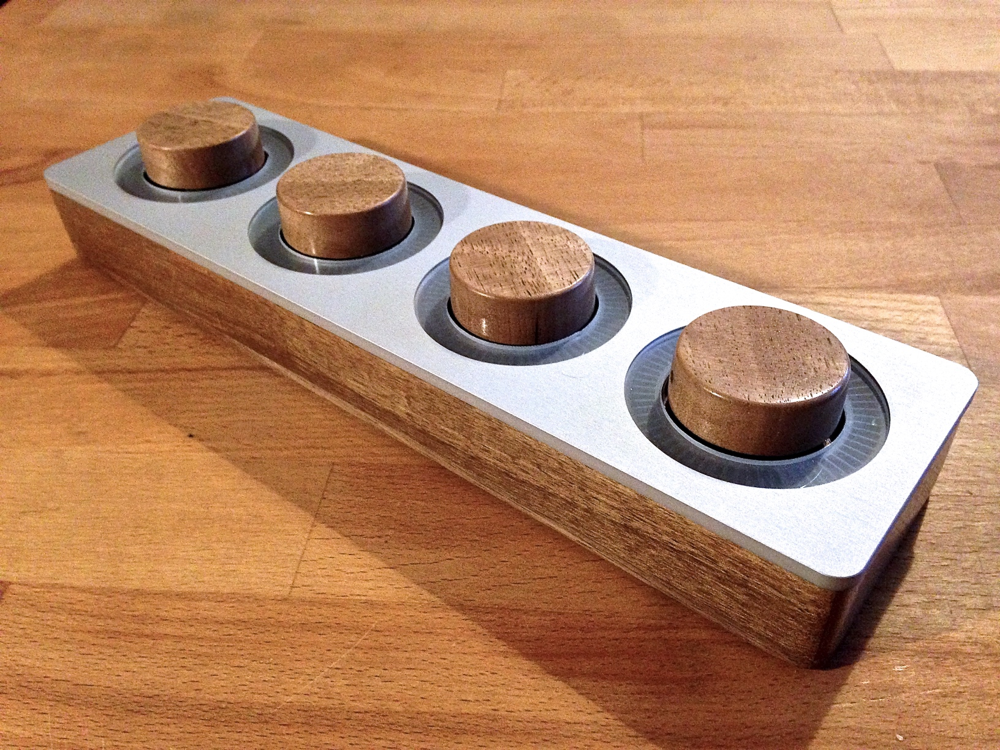